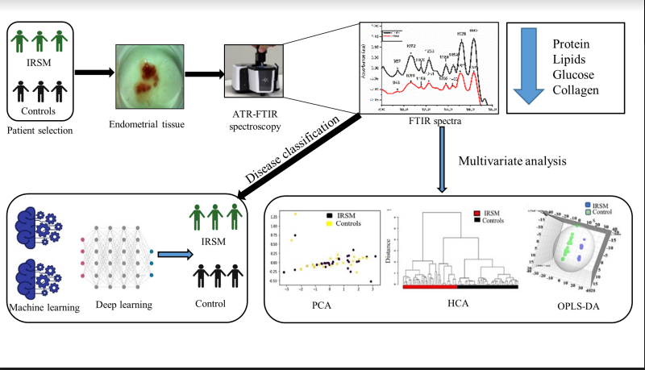
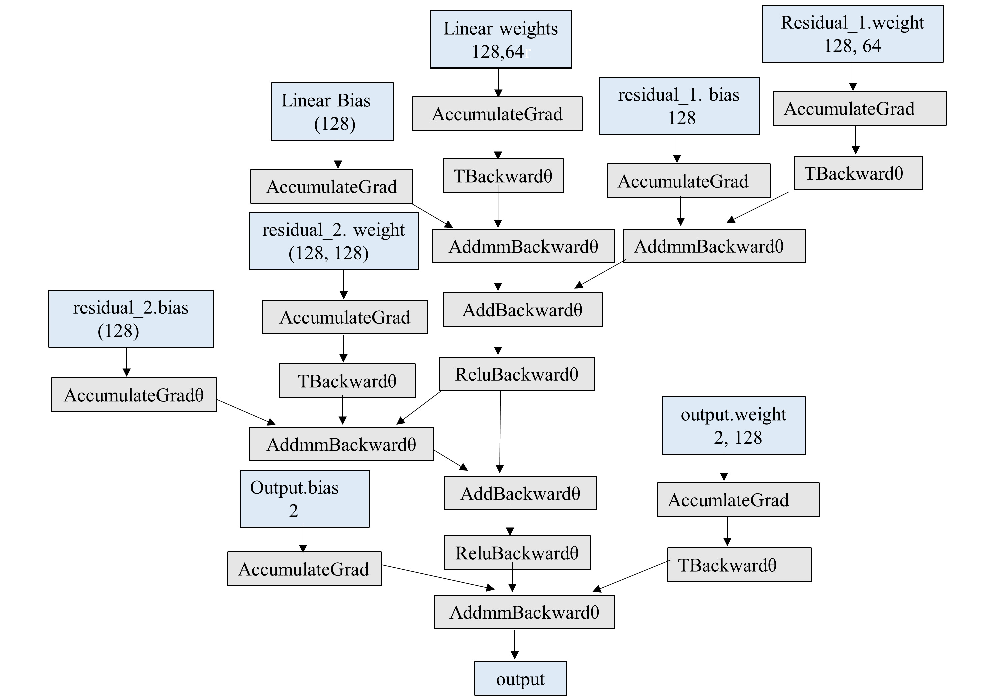
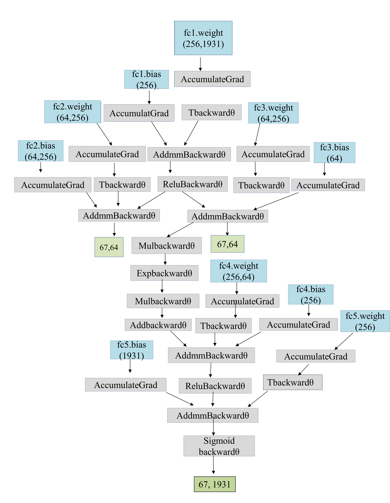
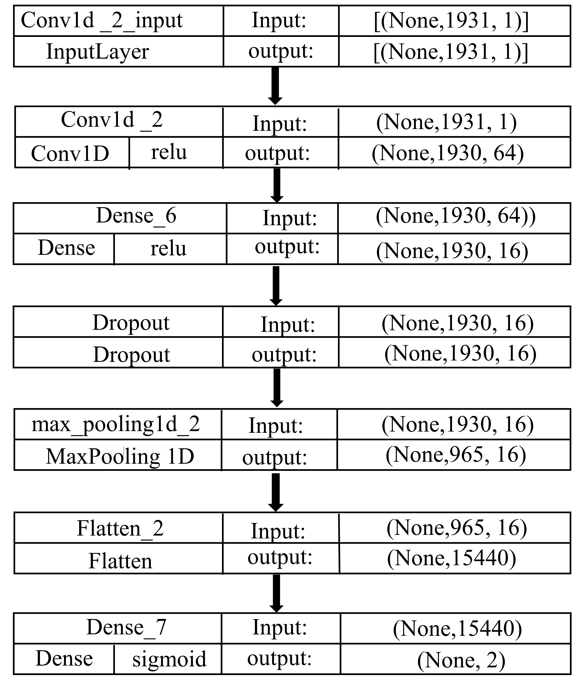
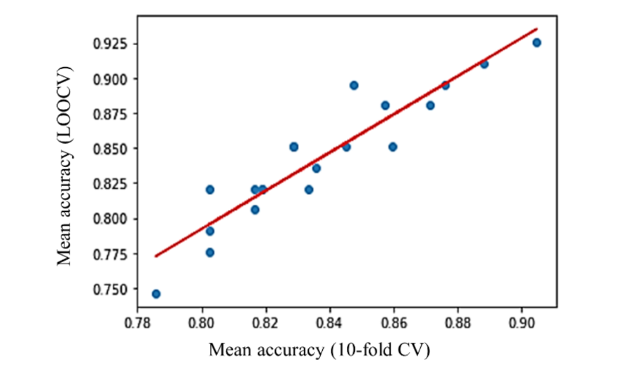
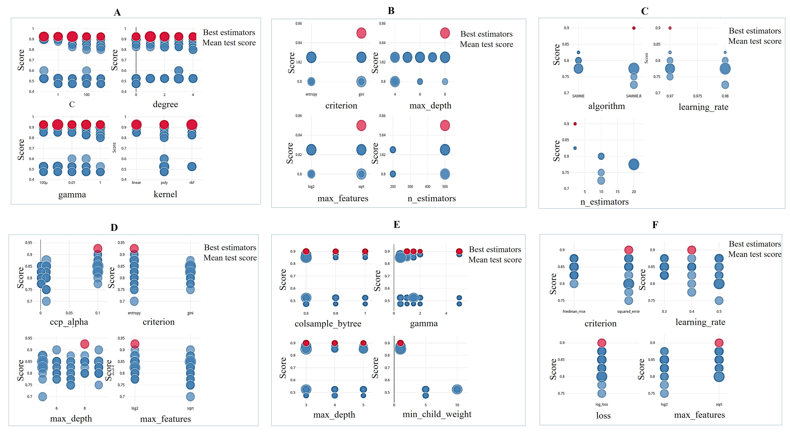
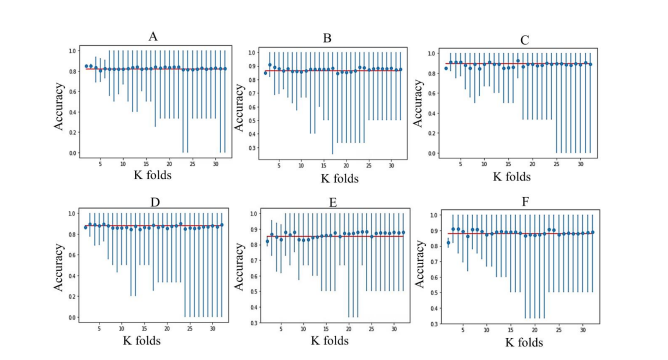

# IRSM Spectral Classification using Machine Learning and Deep Learning
This repository contains code used for our work to predict idiopathic recurrent spontaneous miscarriages using Deep Learning (Specifically Variational Autoencoders, Artificial Neural networks and Convolutional Neural Networks (1D) as well as Classical Machine Learning models)

### To run the code on your setup:
1. Clone the repository to your local machine:
 ```python
 git clone https://github.com/DhruvaRajwade/IRSM_Spectral_Classification_DL.git
 ```

2. Install the required dependencies:
```python
pip install -r requirements.txt
```
## Files

```
|___Root
|
├── R_code/ # Requires the Chemospec package 
│   ├── HCA.R # Sample R Code for Hierarchical Clustering using Agglomerate Euclidean distances
│   └── LDA.R # Sample R Code for a Linear discriminant Analysis
│
├── dev/  # Some experimental code I implemented (Not included in the paper, but interesting nevertheless)
│   ├── PINN.py 
│   └── forward_forward_NIPS.py
│
├── sklearn/ # Classical Machine Learning code
│   ├── cross_validation.py # Functions for Cross Validation and Visualization
│   ├── grid_search.py      # Functions to conduct a GridSearch Hyperparameter sweep
│   ├── model_selection.py  # Functions to help in initial model selection
│   ├── pca_visualize.py    # Visualize PCA outputs using Loadings and scatter plots
│   └── plot.py             # Helper script for grid_search.py
│
├── tensorflow/
│   ├── cnn_bayesian_hyperparam_tuning.py # Bayesian hyperparameter tuning using keras-tuner
│   ├── tf_cnn.py # 1 D CNN
│   └── tf_eval.py # Evaluation and model inference
│
├── torch/
│   ├── torch_eval.py # Evaluation and model inference
│   ├── torch_models.py # Variational Autoencoder and Attention Residual ANN
│   ├── torch_train.py  # Training script
│   ├── vae_cross_validation.py # Cross-validate the pipeline
│   └── vae_loss.py    # Loss functions {KL Divergence and BCE hybrid loss controlled by `Temperature` param, Negative Log Likelihood Loss and MSE loss implementations}
│
├── utils/
│   └── data_preprocessing.py # Helper functions to convert the data from raw form to Numpy (for Sklearn and TF) or Torch tensors(For Pytorch)
│
├── README.md (What you're reading)
└── requirements.txt (Generated using pipreqs!)
```
## Overview Of Methodology



## Model Architectures:

### ANN



### Variational Autoencoder


### 1D CNN


## Results

### Initial Model runs (For Model Selection)

| Classifier                       | Ideal Value | CV Value |
|----------------------------------|-------------|----------|
| Logistic Regression              |   0.821     |  0.817   |
| Ridge Classifier                 |   0.806     |  0.817   |
| SGD Classifier                   |   0.746     |  0.786   |
| Passive Aggressive Classifier    |   0.776     |  0.802   |
| KNeighborsClassifier             |   0.851     |  0.845   |
| Decision Tree                    |   0.910     |  0.888   |
| Linear SVC                       |   0.821     |  0.802   |
| SVC                              |   0.821     |  0.819   |
| Gaussian Naive Bayes             |   0.896     |  0.848   |
| AdaBoost                         |   0.851     |  0.829   |
| BaggingClassifier                |   0.896     |  0.876   |
| Random Forest                    |   0.881     |  0.857   |
| ExtraTrees                       |   0.925     |  0.905   |
| Gaussian Process Classifier      |   0.821     |  0.833   |
| Gradient Boosting                |   0.881     |  0.871   |
| Linear Discriminant Analysis     |   0.791     |  0.802   |
| Quadratic Discriminant Analysis  |   0.836     |  0.836   |
| HistGradientBoostingClassifier   |    0.851    |  0.860   |

### Pearson Correlation Analysis for the above metric data



### Hyperparameter Tuning Of Selected Models
### (A) Support vector machine (SVM) (B) Random forest (RF) (C) Adaptive Boosting (AdaBoost) (D) Decision tree (DT) (E) Extreme Gradient Boosting (XGBoost) (F) Gradient boosting (GB) (=)


### Results of best performing models 

| Model | Sensitivity | Specificity | Accuracy | F1 Score |
|-------|-------------|-------------|----------|----------|
| SVM   |    81%      |    100%     |   90%    |   90%    |
| XGBoost |   80%      |    90%      |   85%    |   84%    |
| AdaBoost |   80%      |    90%      |   85%    |   84%    |
| DT    |    80%      |    90%      |   85%    |   84%    |
| RT    |    80%      |    90%      |   85%    |   84%    |
| GB    |    80%      |    90%      |   85%    |   84%    |
| CNN   |    90%      |    100%     |   94%    |   95%    |
| ANN   |    88%      |    87%      |   88%    |   89%    |

### Learning Curves For Best Performing Models 
### ((A) Support vector machine (SVM) (B) Adaptive boosting (AdaBoost) (C) Extreme boosting (XGBoost) (D) Gradient boosting (E) Decision tree (F) Random forest)


### K Fold Cross Validation: Sensitivity Analysis of the value of K 
### ((A) Support vector machine (SVM) (B) Adaptive boosting (AdaBoost) (C) Extreme boosting (XGBoost) (D) Gradient boosting (E) Decision tree (F) Random forest )


### Todo: 
Add Example Notebooks
Add RayTune hyperparameter sweep code
